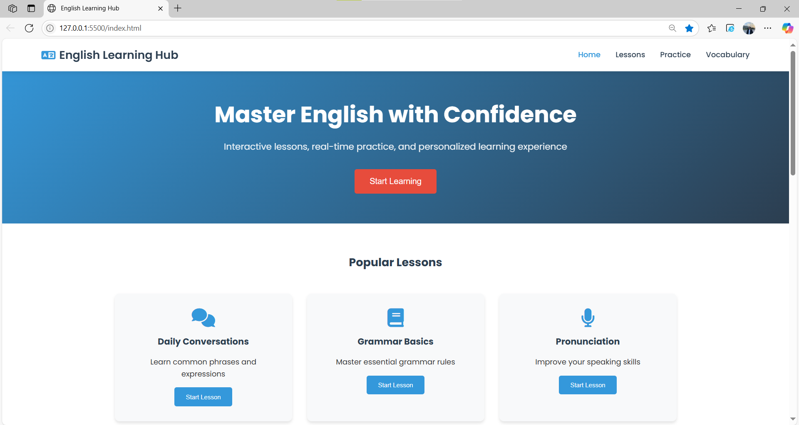
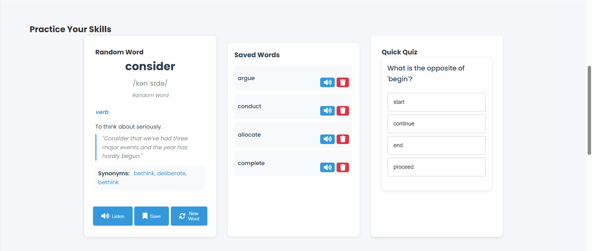
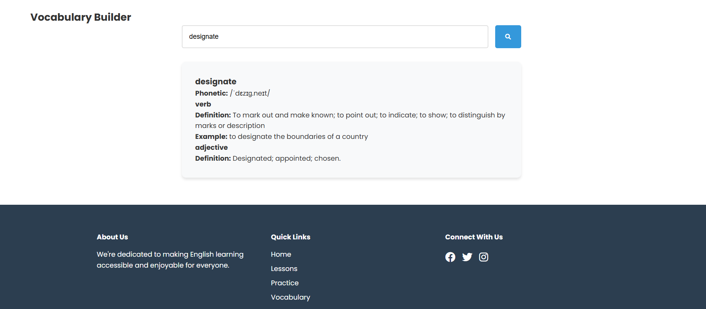

# English Learning Hub

## Proje Açıklaması

**English Learning Hub**, İngilizce öğrenmek isteyenler için interaktif ve modern bir web uygulamasıdır. Kullanıcı dostu arayüzü ve çeşitli öğrenme modülleriyle, dil becerilerinizi geliştirmek için ihtiyacınız olan her şeyi sunar.

## Özellikler

- **Ana Sayfa:** Kısa tanıtım ve hızlı başlatma butonu.
- **Dersler:** Günlük konuşmalar, temel gramer ve telaffuz gibi popüler dersler.
- **Pratik:** Günün kelimesi, kaydedilen kelimeler ve mini quiz ile pratik yapma imkanı.
- **Kelime Hazinesi:** Kelime arama, detaylı açıklama, eş ve zıt anlamlılar.
- **Modern Tasarım:** Responsive ve kullanıcı dostu arayüz.

## Kullanım

1. Proje dosyalarını bilgisayarınıza indirin veya klonlayın.
2. `index.html` dosyasını bir tarayıcıda açın.
3. Ana sayfadan başlayarak dersleri keşfedebilir, pratik yapabilir ve kelime arayabilirsiniz.

## Katkı ve Geri Bildirim

Katkı ve öneriler için: sametsagir6969@gmail.com

---

